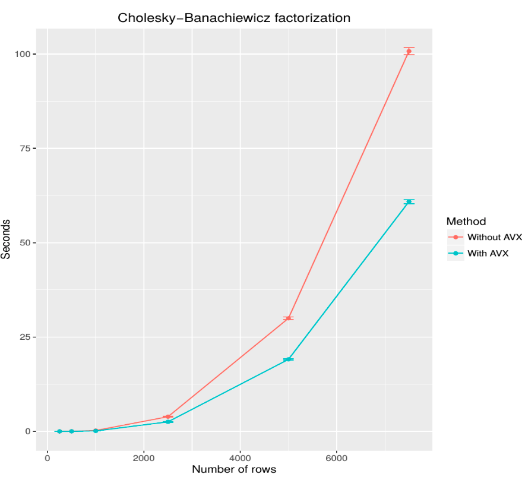

# Optimizing Cholesky Factorization with Intel AVX Instructions

This is the final project for the Distriduted Algorithms class at the [Ukrainian Catholic University](https://ucu.edu.ua).

Software packages like R call native functions highly optimized native libraries like LAPACK, BLAS or Intel MKL. As of this time only MKL library makes use of AVX instructions of Intel processors, which gives it an [amazing advantage over competitors](https://software.intel.com/en-us/articles/performance-comparison-of-openblas-and-intel-math-kernel-library-in-r).

In this work I demonstrate how AVX instructions can be used to speed up the execution of widely used numerical algorithms, using Cholesky factorization as an example. This algorithm was chosen because of its simplicity and wide range of applications.

**Keywords:** SIMD, AVX, parallel algorithms, numerical methods, Cholesky factorization

## Project structure

* [Project report](report/CholeskyAVX.pdf)
* [R script for generating data](datagen/GenerateMatrix.R)
* [Source code](src/)
* [Experimental results](data/experiment_results.csv)
* [Script for visualizing results](visualization/exrepiment.R)
